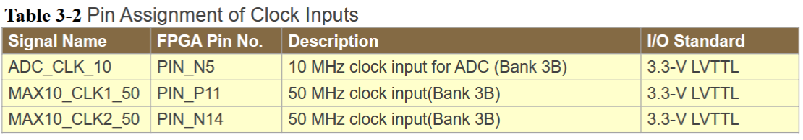

# Cycle Conspiracy Challenge Writeup

Rising-edge logic hints toward a clock component. 

In order to find any of the documentation on the functionality of this FPGA, we can check the manual found [here](https://ftp.intel.com/Public/Pub/fpgaup/pub/Intel_Material/Boards/DE10-Lite/DE10_Lite_User_Manual.pdf).

In the manual, we can search for the clock pin inputs:

Wrap the first pin's name around ISTS{} and submit ISTS{PIN_P11}.