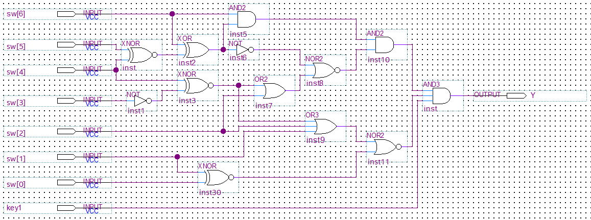

# Gate Gambit Challenge Writeup

Once the board is plugged in, nothing will happen but that is because we do not have the correct input sequence.
In order to determine the input sequence, check the circuit diagram here:

There is only one set of inputs that will make the output high. Those values can be determined by the diagram and can be seen here:
| sw[6]    | sw[5]   | sw[4]    | sw[3]   | btn[2]   | btn[1]  | btn[0]   |  key[1]  |
| -------- | ------- | -------- | ------- |--------  | ------- | -------- |  ------  |
| 1        | 0       | 1        | 1       | 0        | 0       | 1        |  1       |

Set the switches and buttons to this sequence of inputs and the LEDs will flash through the ASCII values for the flag.
Collect and decode the ASCII values for the flag: ISTS{G4T3_0V3RR1D3}