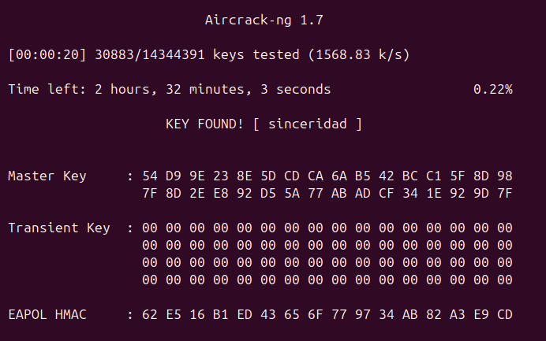
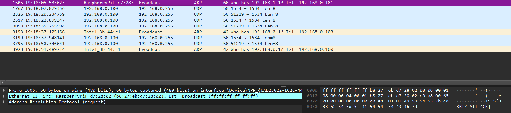

# Handshake Havoc Challenge Writeup

Most networks nowadays use the WPA2 encryption standard so we can assume the only way to find the WiFi password is to brute-force it. The only way to be able to brute-force WPA2 is if we have a 4-way handshake with the access point. Thankfully, we were given that.

First, boot up a linux VM and install aircrack-ng.
Aircrack-ng is a suite of WiFi testing tools, one of which being the self-titled aircrack-ng command. When given a wordlist, this command will brute-force the WiFi key using the following syntax:
`sudo aircrack-ng -w <wordlist> <capture>`

The standard rockyou.txt wordlist will suffice and the capture is the one we are given. The output for aircrack-ng after about 2 minutes of searching will look something like this:

The cracked network password is `sinceridad` and can be used to either join the network or decrypt the network traffic in the capture.

Since we were told the flag is being broadcasted on the network, we join the network and start a wireshark capture. Let it run for at least one minute then sort by the WAN broadcast address: `ff:ff:ff:ff:ff:ff` using the filter: 
`eth.addr == ff:ff:ff:ff:ff:ff` and view the ethernet frame for the flag: `ISTS{H3RTZ_ATT4CK}`

