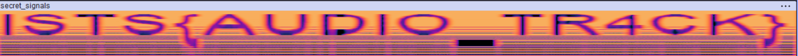

# Secret Signals Challenge Writeup
**Included file:** secret_signals.wav

We are given a .wav file. Obviously the first couple of steps would be to:
1. Listen to the file
2. Open the file in a frequency analyzer like Audacity

When The file is opened in Audacity, it will look like random data. But, if we view as a spectrograph we are met with the flag clearly spelled out:
