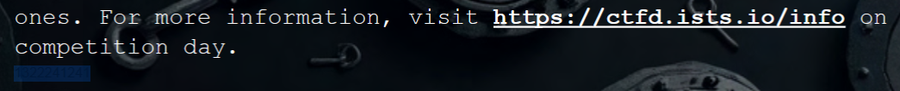
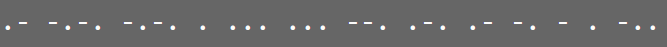

# Vault 0xFF Challenge Writeup

This challenge takes advantage of a finite-state machine to track an input sequence.
Once the board is plugged in, nothing will happen because we have not inputted the correct input sequence.
We were told we already have the input sequence and if any competitors had a keen eye, they would see the sequence under the CTF section in the packet:

We see the sequence is "1322241241".
Now, given we have 4 buttons, each correspond to pins:
| 4        | 3       | 2        | 1       |
| -------- | ------- | -------- | ------- |
| sw[3]    | sw[2]   | sw[1]    | sw[0]   |

Hit the buttons in that specific order and the board will start flashing morse code in the sequence:

Collect and decode the morse code for the flag: ISTS{ACCESSGRANTED}